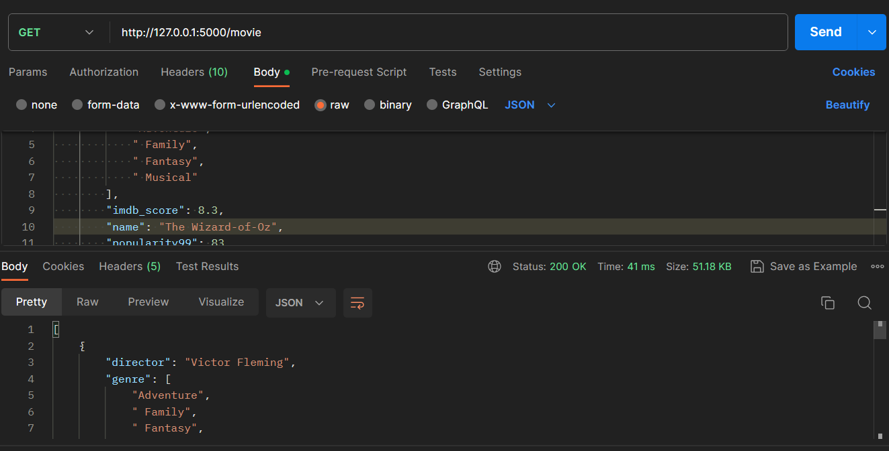
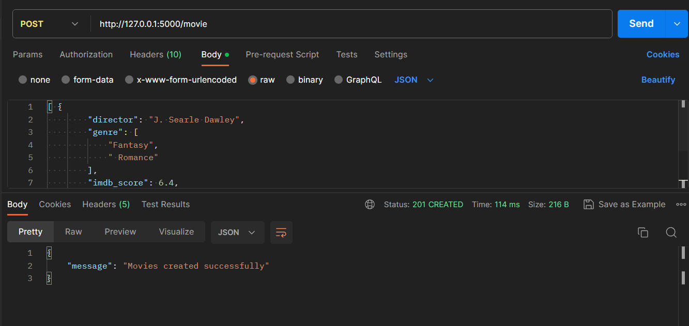
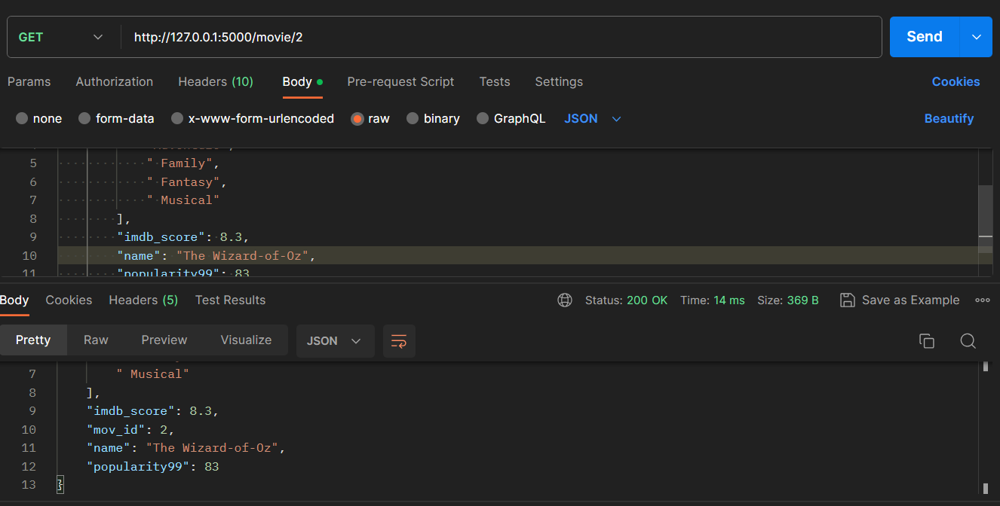
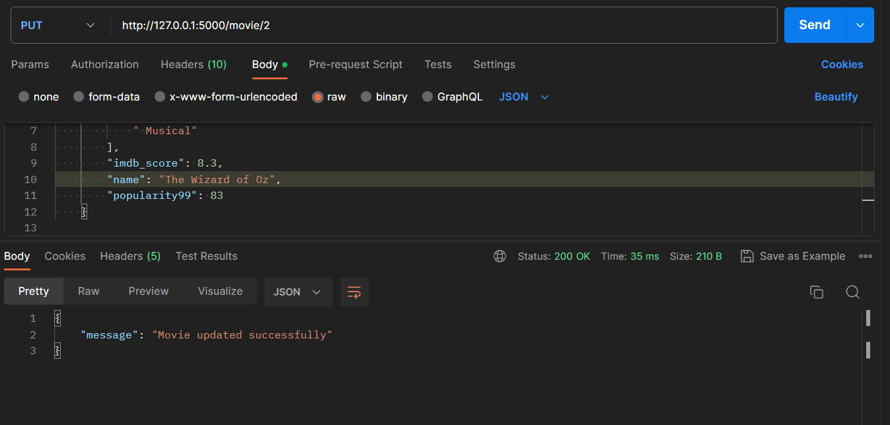
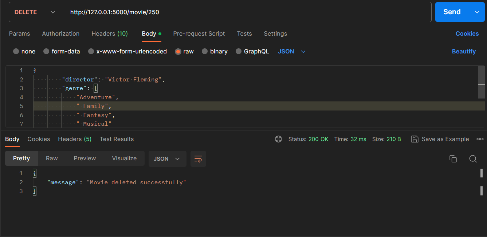
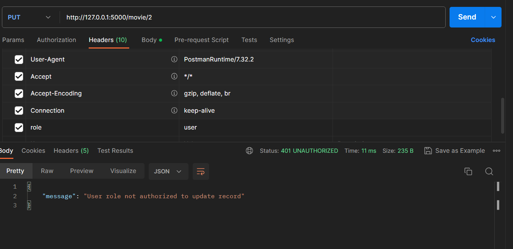
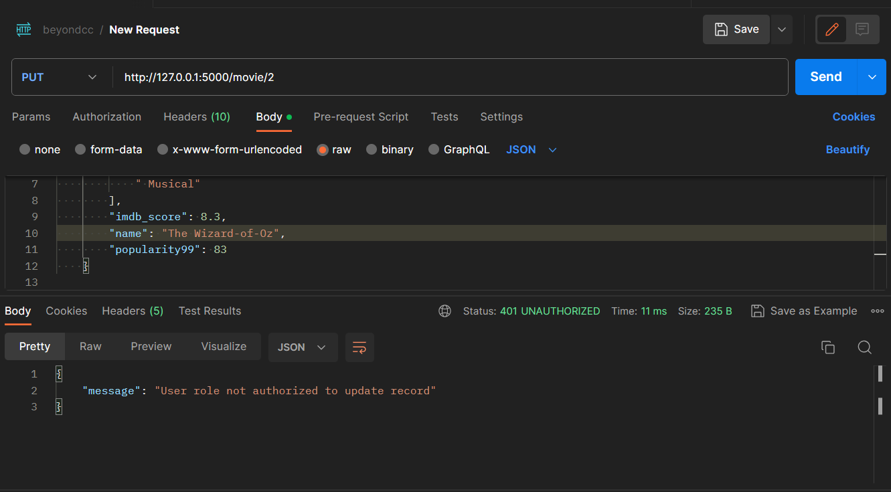
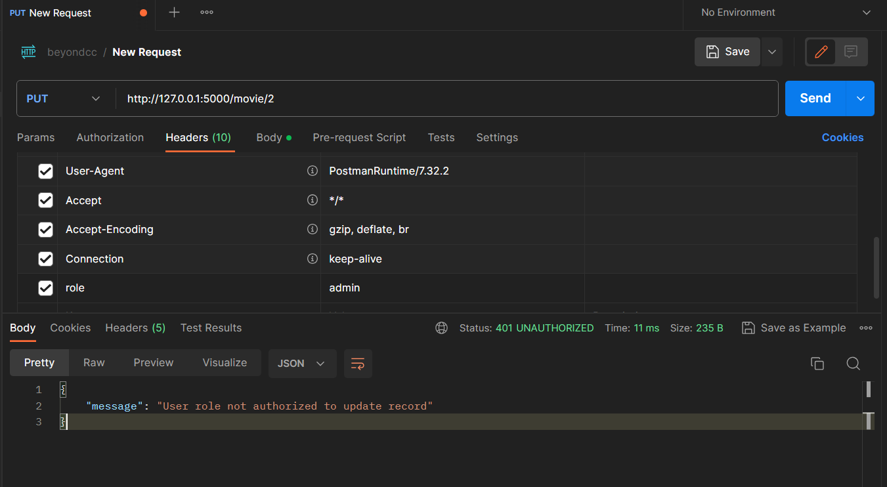
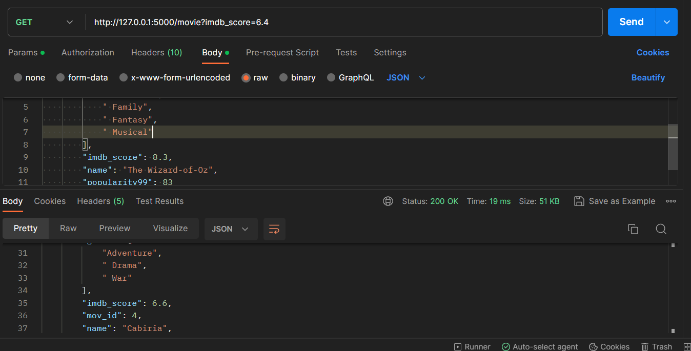
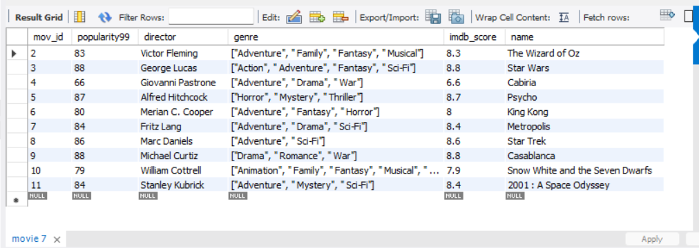

# Flask Backend API

## Table of Contents

- [Overview](#overview)
- [Getting Started](#getting-started)
  - [Prerequisites](#prerequisites)
  - [Installation](#installation)
- [Usage](#usage)
  - [Running the Application](#running-the-application)
  - [API Endpoints](#api-endpoints)
- [Authentication](#authentication)
- [Searching](#search)
- [Database](#database)
- [Scaling](#scaleup)
- [Contributing](#contributing)


## Overview

This is a Python Flask backend API project that provides endpoints for [describe the purpose of your API, e.g., managing movie data].

## Getting Started

### Prerequisites

Before you begin, ensure you have met the following requirements:

- [Python](https://www.python.org/) (version X.X.X)
- [Virtualenv](https://pypi.org/project/virtualenv/) (recommended for isolating dependencies)
- [Pip](https://pip.pypa.io/en/stable/) (package manager)

### Installation

1. Clone the repository:

   ```bash
   git clone https://github.com/ravix007/FlaskRestful
   ```

2. Navigate to the project directory:

   ```bash
   cd FlaskRestful
   ```

3. Create a virtual environment (optional but recommended):

   ```bash
   virtualenv venv
   ```

4. Activate the virtual environment:

   ```bash
   source venv/bin/activate  # On Windows, use venv\Scripts\activate
   ```

5. Install project dependencies:

   ```bash
   pip install -r requirements.txt
   ```

## Usage

### Running the Application

To run the Flask application, use the following command:

```bash
python app.py
```

The API will be accessible at `http://localhost:5000`.

### API Endpoints

Here are the available API endpoints:

- **Endpoint 1:** GET ALL : It gets all your records from the database.
  - Method: `GET`
  - URL: `/movie`
  

  

- **Endpoint 2:** POST: It takes the json and saves it into the database.
  - Method: `POST`
  - URL: `/movie`
  
 
- **Endpoint 3:** Get By Id: It takes ID and fetches that particular record from database.
  - Method: `GetByID`
  - URL: `/movie/{ID}`
  
  
- **Endpoint 4:** PUT:It updates the existing record in database by fetching it with ID .
  - Method: `PUT`
  - URL: `/movie/{ID}`
  

- **Endpoint 5:** Delete:It deletes existing record from the database using ID.
  - Method: `DELETE`
  - URL: `/movie/{ID}`
  
  
## Authentication

- For role based API access requirement, I made use of two user roles namely "admin" and "user". The user role was passed as custom request header through postman (role=admin/user).

- The "admin" role has access to perform all operations - Create, Read, Update, Delete and Search whereas user role has access to fetch all records from DB,fetch one record based on ID from DB and search records in DB based on various combinations of search patameters. 

- In the production grade system we would implemented user login with token based authentication and DB based user's role authorisation.

- Assigning the role as User.

- We get the message as the user is not authorized to perform the action.

- But we can successfully access and read the data as user

- Similarly, assigning the role as admin allows us to perform manipulations on the data by doing put,post ,delete

- We can successfully perform (for example) the put operation


## Searching 

The search method implemented can be used to succesfully search the data on the basis of diiferent columns and their combinations.

1. **Endpoint**: The search functionality is accessible via an endpoint, typically something like `/api/movies?name=Snow White&imdb_score=6.4`.

2. **Query Parameters**: Users can specify search criteria using query parameters in the URL. These query parameters include:

   - `min_imdb`: The minimum IMDb score for movies to be included in the search.
   - `director`: The name of the movie director to filter by.
   - `year`: The release year of the movie.
   - `genre`: The genre of the movie.
   - `name`: The name of the movie.

3. **Query Building**: Within the Flask route handling the search, you build a database query based on the provided query parameters. You construct a base query that selects all movies and then add filters to it based on the criteria provided.

4. **Filtering**: Each query parameter is used to filter the movies. For example:

   - If `min_imdb` is provided, you filter movies with IMDb scores greater than or equal to the specified value.
   - If `director` is provided, you filter movies directed by that director.
   - If `year` is provided, you filter movies released in that year.
   - If `genre` is provided, you filter movies that contain the specified genre.
   - If `name` is provided, you filter movies with the exact specified name.

5. **Execution**: After adding all the filters, you execute the final query, which returns a list of movies that match the combined criteria.

6. **Response**: The matched movies are serialized into a JSON response and returned to the client. Each movie typically includes details like `mov_id`, `popularity99`, `director`, `genre`, `imdb_score`, and `name`.

7. **Error Handling**: You also handle exceptions to provide appropriate error responses if there are any issues during the search.

This search function provides users with the flexibility to search for movies based on multiple criteria, making it easy to find specific movies in your movie database. It's a powerful feature for users who want to discover or filter movies based on their preferences.


## Database

- I have used MySQL database as our SQL DB. The table name is movie. 

- The JSON input file that I received was used to populate the entries in DB table by making use of the "Post All" endpoint that I created.

- This saved effort of writing another DB data import script and was also useful to insert one or more objects for the real time functioning of the application.


## Scaling
For scaling of the application I would go with the following:

1. Dockerize the application
2. Gunicorn -  Web Server Gateway Interface (WSGI) HTTP server for Python Flask 
3. Nginx -  reverse proxy, serving static pages, caching, SSL handling,  
4. Kubernetes - Auto-scaling (scale up and scale down of pods), Zero downtime deployment, managing containerized applications
5. Using Indexing of DB columns for faster fetch ( if the insert/update load is low )
6. Implement Database Replication to avoid single point of failure and data loss
7. Implement DB connection pooling  
8. Do vertical scaling ( increasing CPU and/or RAM) of the Database if the request are too much to handle
9. Perform Data Fragmentation ( in case the fetch/query time is not that big of a concern  )
10. Pagination of the API 
11. Robust Custom Error Handling 
12. Async Bulk Insert
13. Health check/minoitoring of the service(s) and notification in case of something goes down

## Contributing

If you'd like to contribute to this project, please follow the [Contribution Guidelines](CONTRIBUTING.md).

